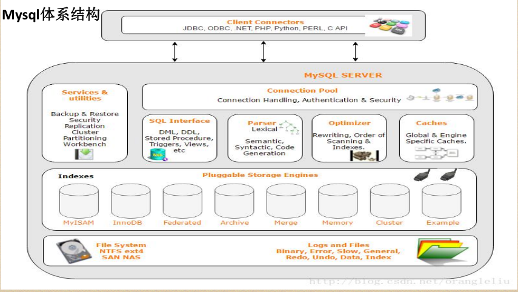
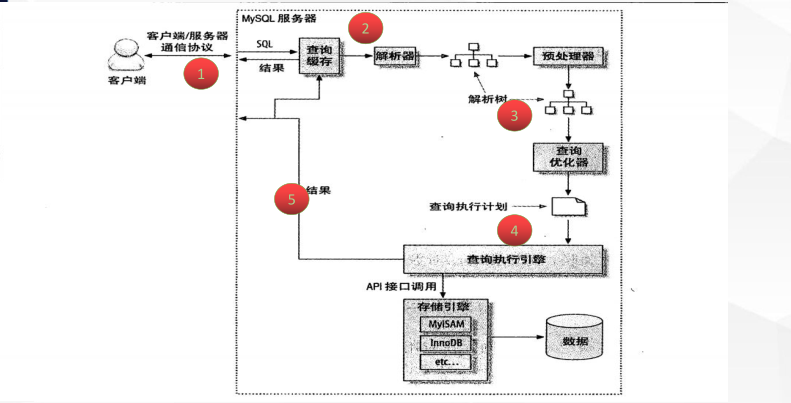

#  插拔式的存储引擎

> 插拔式的插件方式

> 存储引擎是指定在表之上的，即一个库中的每一个表都可以指定专用的存储引擎

> 不管表采用什么样的存储引擎，都会在数据区，产生对应 ，不管表采用什么样的存储引擎，都会在数据区，产生对应的一个 的一个frm文件（表结构定义描述文件）。

## CSV存储引擎

> 数据存储以 数据存储以CSV文件

#### 特点：

> 编辑之后，要生效使用flush table XXX 命令

- 不能定义没有索引、列定义必须为NOT NULL、不能设置自增列

> 不适用大表或者数据的在线处理

- CSV数据的存储用,隔开，可直接编辑CSV文件进行数据的编排

> 数据安全性低

#### 应用场景

- 数据的快速导出导入
- 表格直接转换成 表格直接转换成CSV

## Archive存储引擎

> 压缩协议进行数据的存储
> 数据存储为 数据存储为ARZ文件格式

#### 特点

- 只支持insert和select两种操作
- 只允许自增ID列建立索引
- 行级锁
- 不支持事务
- 数据占用磁盘少

#### 应用场景

- 日志系统
- 大量的设备数据采集

## memory存储引擎

> 数据都是存储在内存中， 数据都是存储在内存中，IO效率要比其他引擎高很多 效率要比其他引擎高很多服务重启数据丢失，内存数据表默认只有 服务重启数据丢失，内存数据表默认只有16M

#### 特点

- 支持hash索引，B tree索引，默认hash（查找复杂度0(1)）
- 字段长度都是固定长度varchar(32)=char(32)
- 不支持大数据存储类型字段如 blog，text
- 表级锁

#### 应用场景

- 等值查找热度较高数据
- 查询结果内存中的计算，大多数都是采用这种存储引擎
- 作为临时表存储需计算的数据

## myisam存储引擎

> - Mysql5.5版本之前的默认存储引擎 版本之前的默认存储引擎
> - 较多的系统表也还是使用这个存储引擎
> - 系统临时表也会用到 系统临时表也会用到Myisam存储引擎

#### 特点

- select count(*) from table 无需进行数据的扫描
- 数据（MYD）和索引（MYI）分开存储
- 表级锁
- 不支持事务

## innodb存储引擎

> Mysql5.5及以后版本的默认存储引擎

#### 特点

- 事务
- 行级锁
- 聚集索引
- 支持外键关系保证数据完整性

# MySQL体系结构及运行机理

## MySQL体系结构

#### Client Connectors

> 接入方 支持协议很多

#### Management Serveices & Utilities

> 系统管理和控制工具，mysqldump、 mysql复制集群、分区管理等

#### Connection Pool

> 连接池：管理缓冲用户连接、用户名、密码、权限校验、线程处理等需要缓存的需求

#### SQL Interface

> SQL接口：接受用户的SQL命令，并且返回用户需要查询的结果

#### Parser
> 解析器，SQL命令传递到解析器的时候会被解析器验证和解析。解析器是由Lex和YACC实现的

#### Optimizer
> 查询优化器，SQL语句在查询之前会使用查询优化器对查询进行优化

#### Cache和Buffer（高速缓存区）
>  查询缓存，如果查询缓存有命中的查询结果，查询语句就可以直接去查询缓存中取数据

#### pluggable storage Engines
> 插件式存储引擎。存储引擎是MySql中具体的与文件打交道的子系统

#### file system
> 文件系统，数据、日志（redo，undo）、索引、错误日志、查询记录、慢查询等

## MySQL 查询优化详解

-  mysql  客户端/ / 服务端通信
- 查询缓存
- 查询优化处理
- 查询执行引擎
- 返回客户端

### mysql  客户端/ / 服务端通信

> Mysql 客户端与服务端的通信方式是 "半双工" 

##### 半双工

> - 全双工：双向通信，发送同时也可以接收
>
> - 半双工：双向通信，同时只能接收或者是发送，无法同时做操作
> - 单工：只能单一方向传送

###### 半双工通信：
在任何一个时刻，要么是有服务器向客户端发送数据，要么是客户端向服务端发
送数据，这两个动作不能同时发生。所以我们无法也无需将一个消息切成小块进
行传输

###### 特点和限制：
客户端一旦开始发送消息，另一端要接收完整个消息才能响应。
客户端一旦开始接收数据没法停下来发送指令

##### 查询状态

> 对于一个 mysql 连 接，或者说一个线程，时刻都有一个状态来标识这个连接正在做什么
>
> 可通过 kill {id} 的方式进行连接的杀掉

###### 查看命令

> show full processlist / show processlist
>
> - Sleep
>
>   > 线程正在等待客户端发送数据
>
> - Query
>
>   > 连接线程正在执行查询
>
> - Locked
>
>   > 线程正在等待表锁的释放
>
> - Sorting result
>
>   > 线程正在对结果进行排序
>
> - Sending data
>
>   > 向请求端返回数据

### 查询缓冲

#### 工作原理：

- 缓存 SELECT 操作的结果集和 SQL 语句；
- 新的 SELECT 语句，先去查询缓存，判断是否存在可用的记录集

#### 判断标准

> show VARIABLES like '%query_cache%';
>
> 与缓存的 SQL 语句，是否完全一样，区分大小写
> ( 简单认为存储了一个 key-value 结构， key 为 sql ， value 为 sql)

#### 查看缓冲

##### query_cache_type

> 需要在总配置文件里面指定 

> - 值： 0 -–  不启用查询缓存 ，默认值 

> - 值： 1 -–  启用查询缓存，只要符合查询缓存的要求，客户端的查询语句和记录集
>   都可以缓存起来，供其他客户端使用 ，加上 SQL_NO_CACHE 将不缓存
>
> > select SQL_NO_CACHE  *  from user where id=1

> - 值： 2 -–  启用查询缓存，只要查询语句中添加了参数： SQL_CACHE ，且符合查询
>   缓存的要求，客户端的查询语句和记录集，则可以缓存起来，供其他客户端使用
>
> > select SQL_CACHE  *  from user where id=1

##### query_cache_size
> 针对 所有的查询语句
>
> 允许设置 query_cache_size 的值最小为 40K ， 默认 1M ， 推荐设置 为： 64M/128M ；

##### query_cache_limit
> 针对于单个的查询语句
>
> 限制查询缓存区最大能缓存的查询记录集，默认设置为 1M
>

##### show status like 'Qcache%' 

| Qcache_free_blocks               | 1       |
| -------------------------------- | ------- |
| Qcache_free_memory               | 1031832 |
| Qcache_hits(命中的次数)          | 0       |
| Qcache_inserts（插入缓冲的次数） | 0       |
| Qcache_lowmem_prunes             | 0       |
| Qcache_not_cached                | 0       |
| Qcache_queries_in_cache          | 458148  |
| Qcache_total_blocks              | 0       |
|                                  |         |

#### 不会用到缓冲的地方

- 当查询语句中有一些不确定的数据时，则不会被缓存。如包含函数 NOW() ，
  CURRENT_DATE() 等类似的函数，或者用户自定义的函数，存储函数，用户变
  量等都不会被缓存

- 当查询的结果大于 query_cache_limit 设置的值时，结果不会被缓存

- 对于 InnoDB 引擎来说，当一个语句在事务中修改了某个表，那么在这个事务
  提交之前，所有与这个表相关的查询都无法被缓存。因此长时间执行事务，
  会大大降低缓存命中率

- 查询的表是系统表

- 查询语句不涉及到表

#### 缓冲的特点

> 为什么mysql 默认关闭了缓存开启

- 在查询之前必须先检查是否命中缓存, 浪费计算资源

- 如果这个查询可以被缓存，那么执行完成后， MySQL 发现查询缓存中没有这
  个查询，则会将结果存入查询缓存，这会带来额外的系统消耗

- 针对表进行 写入或更新数据时，将对应表的所有缓存都设置失效。

- 如果查询缓存很大或者碎片很多时，这个操作可能带来很大的系统消耗

#### 使用缓冲的范围

- 以读为主的业务，数据生成 之后就 不常改变 的业务
- 比如门户 类 、新闻类、报表 类 、论坛 类等

### 查询优化处理

#### 查询优化处理的三个阶段

1. 解析 sql

   > 通过lex词法分析,yacc语法分析将sql语句解析成解析树
   > https://www.ibm.com/developerworks/cn/linux/sdk/lex/

2. 预处理阶段

   > 根据mysql的语法的规则进一步检查解析树的合法性，如：检查数据的表
   > 和列是否存在，解析名字和别名的设置。还会进行权限的验证

3. 查询优化器

   > 优化器的主要作用就是找到最优的执行计划

#### 查询优化器如何找到最优执行计划

> Mysql 的查询优化器是基于成本计算的原则。他会尝试各种执行计划。
> 数据抽样的方式进行试验（随机的读取一个 4K 的数据块进行分析）

1. 使用等价变化规则

   > 5 = 5 and a > 5 改写成 a > 5
   > a < b and a = 5 改写成 b > 5 and a = 5
   > 基于联合索引，调整条件位置等

2. 优化 count  、 min 、 max 等函数

   > min函数只需找索引最左边
   > max函数只需找索引最右边
   > myisam引擎count(*)

3. 覆盖索引扫描

4. 子查询优化

5. 提前终止查询

   > 用了limit关键字或者使用不存在的条件

6. IN 的优化

   > 先进性排序，再采用二分查找的方式

#### 执行计划

##### 执行计划-id

>  select 查询的序列号，标识执行的顺序

###### id相同

> id相同, 执行顺序由上至下

###### id不同

> id不同，如果是子查询，id的序号会递增，id值越大优先级越高，越先被执行

##### id为空

> select_type = UNION RESULT   最后执行

##### 执行计划-select_type

> 查询的类型，主要是用于区分普通查询、联合查询、子查询等

###### SIMPLE

> SIMPLE：简单的select查询，查询中不包含子查询或者union

###### PRIMARY

> PRIMARY：查询中包含子部分，最外层查询则被标记为primary

###### SUBQUERY

> SUBQUERY：在select 或 where列表中包含了子查询

###### MATERIALIZED

> MATERIALIZED: where 后面in条件的子查询

###### UNION

> UNION：若第二个select出现在union之后，则被标记为union

###### UNION RESULT

> UNION RESULT：从union表获取结果的select

##### 执行计划-table

> 查询涉及到的表
>
> 直接显示表名或者表的别名

###### unionM    N

> <unionM,N> 由ID为M,N 查询union产生的结果

###### subquery   N

> <subqueryN> 由ID为N查询生产的结果

##### 执行计划-type

> 访问类型，sql 查询优化中一个很重要的指标，结果值从好到坏依次是：
> system > const > eq_ref > ref > range > index > ALL

###### system

> system：表只有一行记录（等于系统表），const类型的特例，基本不会出现，可以忽略不计

###### const

> const：表示通过索引一次就找到了，const用于比较primary key 或者 unique索引

###### eq_ref

> eq_ref：唯一索引扫描，对于每个索引键，表中只有一条记录与之匹配。常见于主键 或 唯一索引扫描

###### ref

> ref：非唯一性索引扫描，返回匹配某个单独值的所有行，本质是也是一种索引访问

###### range

> range：只检索给定范围的行，使用一个索引来选择行

###### index

> index：Full Index Scan，索引全表扫描，把索引从头到尾扫一遍

###### ALL

> ALL：Full Table Scan，遍历全表以找到匹配的行

##### 执行计划-possible_keys | key | rows | filtered

###### possible_keys

> 查询过程中有可能用到的索引

###### key

> 实际使用的索引，如果为 NULL ，则没有使用索引

###### rows

> 根据表统计信息或者索引选用情况，大致估算出找到所需的记录所需要读取的行
> 数

###### filtered

> 它指返回结果的行占需要读到的行 (rows 列的值) ) 的百分比
>
> 表示返回结果的行数占需读取行数的百分比， filtered

##### 执行计划-Extra

###### 	Using filesort 
> mysql 对数据使用一个外部的文件内容进行了排序，而不是按照表内的索引进行排序读取

###### 	Using temporary
> 使用临时表保存中间结果，也就是说mysql 在对查询结果排序时使用了临时表，常见于order by  或 group by

###### 	Using index
> 表示相应的select 操作中使用了覆盖索引（Covering Index ），避免了访问表的数据行，效率高

###### 	Using where
> 使用了where 过滤条件

###### 	select tables optimized away

> 基于索引优化MIN/MAX 操作或者MyISAM 存储引擎优化COUNT(*) 操作，不必等到执行阶段在进行计算，查询执行
> 计划生成的阶段即可完成优化

### 查询执行引擎

> 调用插件式的存储引擎的原子 API 的功能进行执行计划的执行

### 返回客户端

> -  有需要做缓存的，执行缓存操作
>
> - 增量的返回结果：
>
>   > 开始生成第一条结果时 ,mysql  就开始往请求方逐步返回数据
>   >
>   > > 好处：  mysql 服务器无须保存过多的数据 ，用户体验好，马上就拿到了数据 
>   > >
>   > > 坏处： 浪费内存
>   > >

# 定位慢SQL

