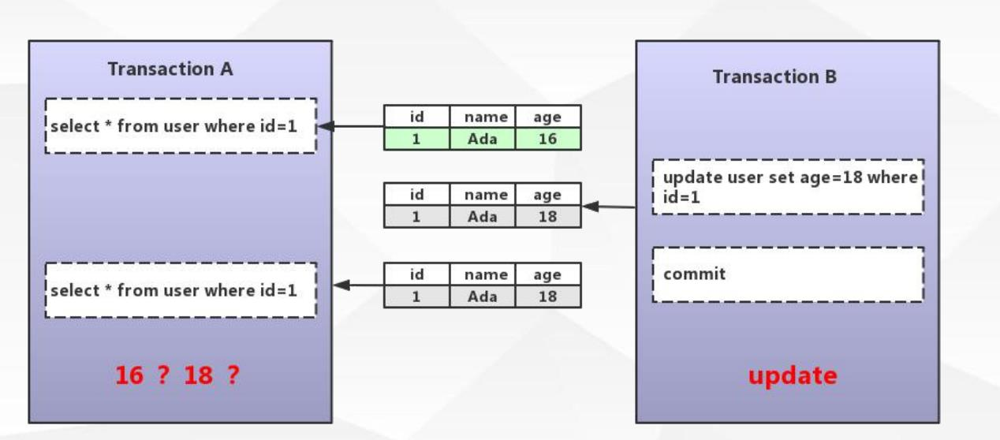

# 事务

> show VARIABLES like 'autocommit';  查看事务状态


> select @@tx_isolation;  查看事务隔离级别

### 事务:

数据库操作的最小工作单元，是作为单个逻辑工作单元执行的一系列操作，事务是一组不可再分割的操作集合（工作逻辑单元）;


#### 典型事务场景(转账)：

```mysql
update user_account set balance = balance - 1000 where userID = 3;

update user_account set balance = balance +1000 where userID = 1;
```

### 如何开启事务

> begin / start transaction 			-- 手工
>
>
> commit / rollback 				-- 事务提交或回滚
>
>
> set session autocommit = on/off;	 -- 设定事务是否自动开启  


> SQL : 	set session autocommit = off;   
>
> 
>
> JDBC:  	connection.setAutoCommit（boolean）;
>
> 
>
> spring:	connection.commit()

#### autocommit 默认为ON  

update user set name ='zhangsan' where id =1;

> 自动提交


#### 如何开启事务


```mysql
BEGIN; 
update user set name ='zhangsan' where id =1;
COMMIT;

BEGIN; 
update user set name ='zhangsan' where id =1;
ROLLBACK;


update user set name ='zhangsan' where id =1;
COMMIT;

START TRANSACTION;
update user set name ='zhangsan' where id =1;
ROLLBACK;

SET SESSION autocommit = OFF;
update user set name ='zhangsan' where id =1;
COMMIT;

SET SESSION autocommit = OFF;
update user set name ='zhangsan' where id =1;
ROLLBACK;
```


###  事务的四大特性

> 原子性（Atomicity）
> 最小的工作单元，整个工作单元要么一起提交成功，要么全部失败回滚
>
>
> 一致性（Consistency）
> 事务中操作的数据及状态改变是一致的，即写入资料的结果必须完全符合预设的规则，
> 不会因为出现系统意外等原因导致状态的不一致
>
>
> 隔离性（Isolation）
> 一个事务所操作的数据在提交之前，对其他事务的可见性设定（一般设定为不可见）
>
> 持久性（Durability）
> 事务所做的修改就会永久保存，不会因为系统意外导致数据的丢失
>
>


### 事务带来的问题


> 脏读   不可重读的  幻读


####  脏读


#### 不可重读的




#### 幻读


### 隔离级别

>  SQL92 ANSI/ISO标准：http://www.contrib.andrew.cmu.edu/~shadow/sql/sql1992.txt


> 隔离级别的实现: 锁  MVCC

#### Read Uncommitted（未提交读） --未解决并发问题

事务未提交对其他事务也是可见的，脏读（dirty read）


#### Read Committed（提交读） --解决脏读问题

一个事务开始之后，只能看到自己提交的事务所做的修改，不可重复读（nonrepeatable
read）


#### Repeatable Read (可重复读) --解决不可重复读问题

在同一个事务中多次读取同样的数据结果是一样的，这种隔离级别未定义解决幻读的问题


#### Serializable（串行化） --解决所有问题

最高的隔离级别，通过强制事务的串行执行


#### innodb引擎对隔离级别的支持程度


> innodb的默认隔离级别是可重复读，但是不存在幻读的情况


# 锁

> 锁是用于管理不同事务对共享资源的并发访问


> 支持行锁与表锁

#### 表锁与行锁的区别

> 粒度  效率   概率 性能

锁定粒度：表锁 > 行锁


加锁效率：表锁 > 行锁


冲突概率：表锁 > 行锁


并发性能：表锁 < 行锁


#### innodb锁的类型

> 共享锁（行锁）：Shared Locks
>
> 排它锁（行锁）：Exclusive Locks
>
> 意向锁共享锁（表锁）：Intention Shared Locks
>
> 意向锁排它锁（表锁）：Intention Exclusive Locks
>
> 自增锁：AUTO-INC Locks
>

> 记录锁 Record Locks

>
>间隙锁 Gap Locks

>
>临键锁 Next-key Locks


##  共享锁

> 又称为读锁，简称S锁，顾名思义，共享锁就是多个事务对于同一数据可以共享一把锁，都能访问到数据，但是只能读不能修改;


### 加锁的方式


```mysql
-- 共享锁加锁
BEGIN;
select * from users WHERE id=1 LOCK IN SHARE MODE;
rollback; 
commit;

-- 其他事务执行
select * from users where id =1;  -- 查询成功

update users set age=19 where id =1; -- 插入失败

```


## 排他锁


> 又称为写锁，简称X锁，排他锁不能与其他锁并存，如一个事务获取了一个数据行的排他
> 锁，其他事务就不能再获取该行的锁（共享锁、排他锁），只有该获取了排他锁的事务是可以对
> 数据行进行读取和修改，（其他事务要读取数据可来自于快照）


```mysql
delete / update / insert 默认加上X锁
SELECT * FROM table_name WHERE ... FOR UPDATE
commit
rollback


set session autocommit = OFF;
update users set age = 23 where id =1;
select * from users where id =1;
update users set age = 26 where id =1;
commit;
ROLLBACK;

-- 手动获取排它锁
set session autocommit = ON;
begin
select * from users where id =1 for update;
commit;

-- 其他事务执行
select * from users where id =1 lock in share mode;
select * from users where id =1 for update;
select * from users where id =1;
```


### 行锁到底锁了什么东西


> InnoDB的行锁是通过给索引上的索引项加锁来实现的


> 只有通过索引条件进行数据检索，InnoDB才使用行级锁，否则，InnoDB将使用表锁（锁住索引的所有记录）

```mysql
DROP TABLE IF EXISTS `users`;
CREATE TABLE `users` (
  `id` int(11) NOT NULL AUTO_INCREMENT,
  `name` varchar(255) DEFAULT NULL,
  `phoneNum` varchar(255) DEFAULT NULL,
  `lastUpdate` datetime DEFAULT NULL,
  PRIMARY KEY (`id`),
  KEY `idx_name` (`name`) USING BTREE
) ENGINE=InnoDB AUTO_INCREMENT=5 DEFAULT CHARSET=utf8;

INSERT INTO `user` VALUES ('1', 'zhangsan', '1366666666', '2018-12-09 23:25:29');
INSERT INTO `user` VALUES ('2', 'lisi', '1377777777', '2018-12-09 23:25:46');
```


#### 实例1

```mysql
-- transaction-1
set session autocommit = OFF;
update users set lastUpdate=NOW() where phoneNum = '13666666666';

-- transaction-2
update users set lastUpdate=NOW() where id =2; -- 加锁

-- transaction-3
update users set lastUpdate=NOW() where id =1; -- 加锁 
```


####  实例2

```mysql
-- transaction-1
set session autocommit = OFF;
update users set lastUpdate=NOW() where id = 1;

-- transaction-2
update users set lastUpdate=NOW() where id =2; -- 成功

-- transaction-3
update users set lastUpdate=NOW() where id =1; -- 加锁

```


####  实例3

```mysql
-- transaction-1
set session autocommit = OFF;
update users set lastUpdate=NOW() where `name` = 'zhangsan';


-- transaction-2
update users set lastUpdate=NOW() where `name` = 'zhangsan'; -- 加锁
update users set lastUpdate=NOW() where id =1; --  加锁

-- transaction-3
update users set lastUpdate=NOW() where `name` = 'lisi'; -- 成功
update users set lastUpdate=NOW() where id =2;-- 成功

```


## 意向共享锁(IS)  意向排它锁(IX)

> 意向共享锁
>
> 表示事务准备给数据行加入共享锁，即一个数据行加共享锁前必须先取得该表的IS锁，意向共享锁之间是可以相互兼容的


> 意向排它锁
>
> 表示事务准备给数据行加入排他锁，即一个数据行加排他锁前必须先取得该表的IX锁，意向排它锁之间是可以相互兼容的


意向锁(IS 、IX) 是InnoDB 数据操作之前


####   意义：

当事务想去进行锁表时，可以先判断意向锁是否存在，存在时则可快速返回该表不能启用表锁


```mysql
-- transaction-1
set session autocommit = OFF;
update users set lastUpdate=NOW() where id = 1;

-- transaction-2
update users set lastUpdate=NOW() where phoneNum = '13777777777';
```


##  自增锁

>  针对自增列自增长的一个特殊的表级别锁


>  show variables like 'innodb_autoinc_lock_mode';


>  默认取值1 ，代表连续，事务未提交ID永久丢失


> select auto_increment from information_schema.`TABLES` where table_name=tableName and TABLE_SCHEMA=baseName

#### 实例

> 现在数据库中的ID最大值为2，在进行三次ROLLBACK操作后再进行insert操作,表中记录最大ID为6


```mysql

begin;
insert into users(name , phoneNum ,lastUpdate ) values ('mysql-1','1344444444',now());
ROLLBACK;

begin;
insert into users(name , phoneNum ,lastUpdate ) values ('mysql-2','1344444445',now());
ROLLBACK;

begin;
insert into users(name , phoneNum ,lastUpdate ) values ('mysql-3','1344444446',now());
ROLLBACK;


begin;
insert into users(name , phoneNum ,lastUpdate ) values ('mysql-4','1344444447',now());
COMMIT;
```


## 临键锁

>  Next-key locks:锁住记录+ 区间（左开右闭),当sql执行按照索引进行数据的检索时,查询条件为范围查找（between and、<、>等）并有数据命中则此时SQL语句加上的锁为Next-key locks， 锁住索引的记录+区间（左开右闭）


> InnoDB 的默认行锁算法

#### 实例

```mysql
CREATE TABLE `t2` (
  `id` int(11) NOT NULL,
  `name` varchar(255) DEFAULT NULL,
  PRIMARY KEY (`id`)
) ENGINE=InnoDB DEFAULT CHARSET=utf8;

INSERT INTO `t2` VALUES ('1', '1');
INSERT INTO `t2` VALUES ('4', '4');
INSERT INTO `t2` VALUES ('7', '7');
INSERT INTO `t2` VALUES ('10', '10');
```


```mysql
-- transaction-1
begin;
select * from t2 where id>5 and id<9 for update;

-- transaction-2
set session autocommit=off;
select * from t2 where id=4 for update;  -- 未加锁
select * from t2 where id=7 for update; -- 未加锁
select * from t2 where id=10 for update; -- 未加锁
INSERT INTO `t2` (`id`, `name`) VALUES (9, '9'); -- 未加锁
```


## 间隙锁

> Gap locks:锁住数据不存在的区间（左开右开）,当sql执行按照索引进行数据的检索时，查询条件的数据不存在，这时SQL语句加上的锁即为Gap locks， 锁住索引不存在的区间（左开右开）


```mysql
-- transaction-1
begin;
select * from t2 where id >4 and id <6 for update;
-- 或者
select * from t2 where id =6 for update;

-- transaction-2
INSERT INTO `t2` (`id`, `name`) VALUES (5, '5');
INSERT INTO `t2` (`id`, `name`) VALUES (6, '6');
```


## 记录锁

> 锁住具体的索引项
> 当sql执行按照唯一性（Primary key、Unique key）索引进行数据的检索时，查询条件等值匹
> 配且查询的数据是存在，这时SQL语句加上的锁即为记录锁Record locks， 锁住具体的索引项


```mysql
-- transaction-1
begin;
select * from t2 where id =4 for update;

-- transaction-2 
select * from t2 where id =7 for update;
select * from t2 where id =4 for update;
```


##  锁解决脏读


## 锁解决不可重复读


## 锁解决幻读


  

## 死锁

- 类似的业务逻辑以固定的顺序访问表和行。


- 大事务拆小。大事务更倾向于死锁，如果业务允许，将大事务拆小。


- 在同一个事务中，尽可能做到一次锁定所需要的所有资源，减少死锁概

率。

- 降低隔离级别，如果业务允许，将隔离级别调低也是较好的选择


- 为表添加合理的索引。可以看到如果不走索引将会为表的每一行记录添

加上锁（或者说是表锁）


