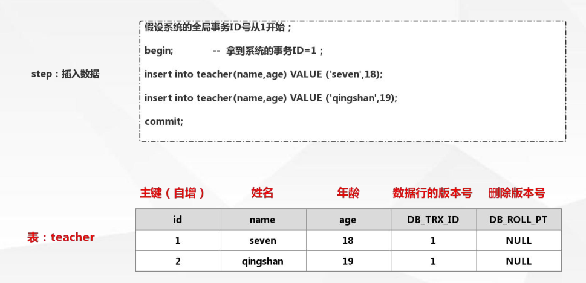
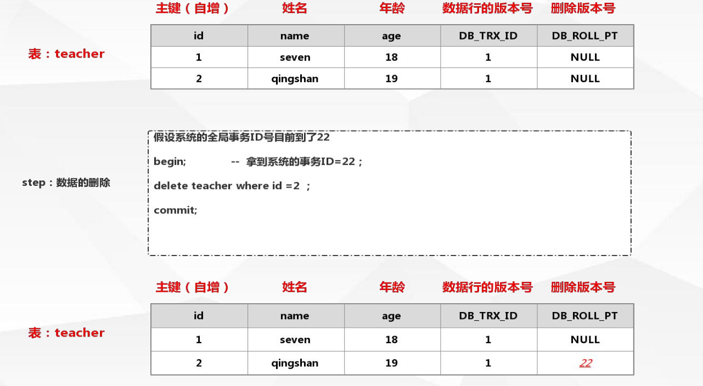
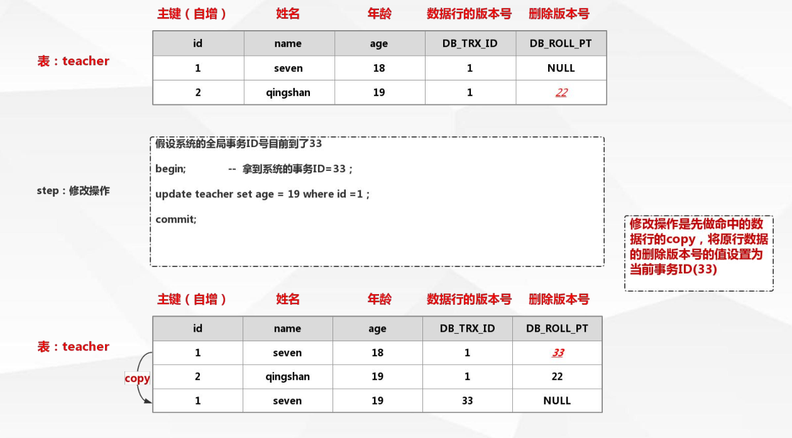
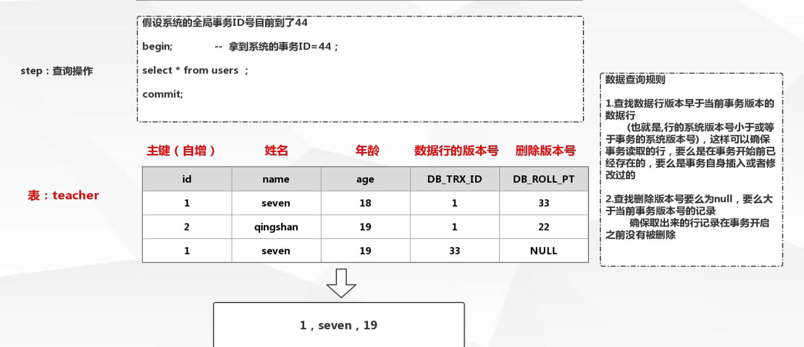
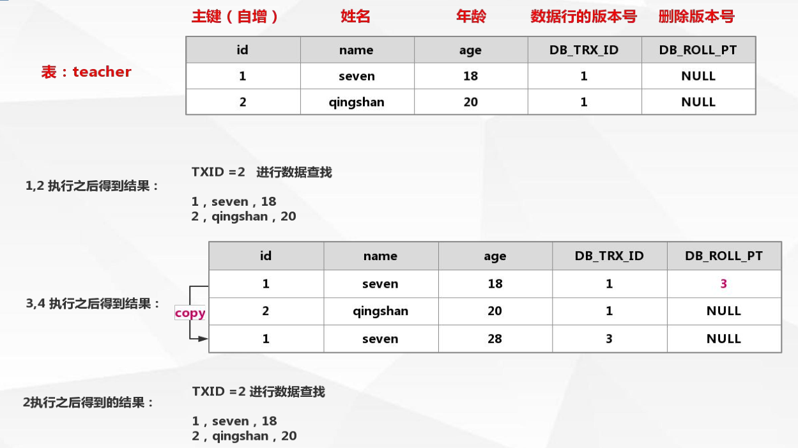
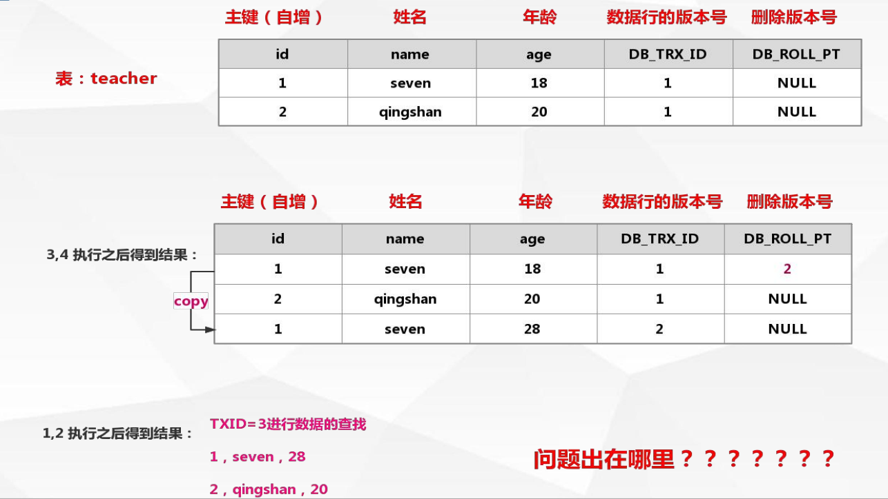
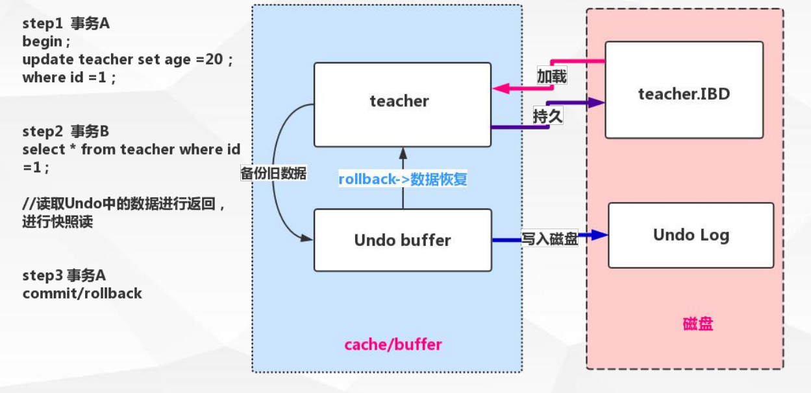
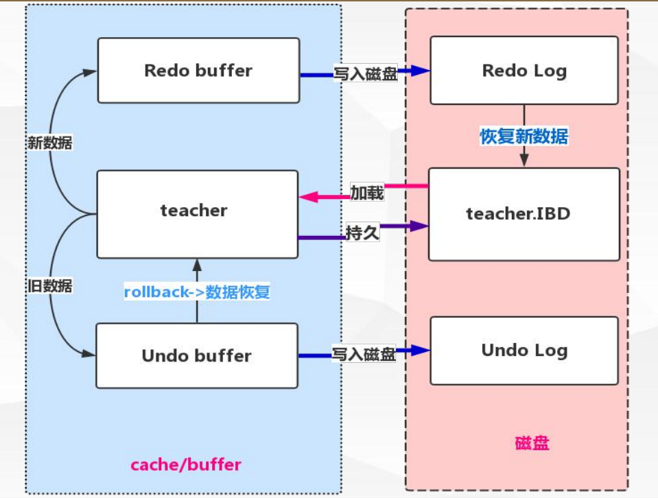

# MVCC

> Multiversion concurrency control (多 版本并发 控制)

> 并发访问(读或写)数据库时，对正在事务内处理的数据做多版本的管理。以达到用来避免写操作的堵塞，从而引发读操作的并发问题。

## mvcc 逻辑流程-插入


> 每张表mysql都是插入一些隐藏的列
>
> - 数据行的版本号
> - 删除版本号



> mysql的事务有全局的事务ID号，当开始事务事，会拿到事务的ID号。将事务的ID赋给数据行的版本号

## mvcc 逻辑流程-删除




## mvcc 逻辑流程-修改




> 先copy  后 删除


## vcc 逻辑流程-查询





## mvcc版本控制案例

>  数据准备：
> insert into teacher(name,age) value ('seven',18) ;
> insert into teacher(name,age) value ('qing',20) ;
>
> 操作语句
>
> tx1:
>
> > begin; 			----------1
> >
> > select * from users ; 			----------2
> >
> > commit;
>
> tx2：
>
> > begin; 			----------3
> >
> > update teacher set age =28 where id =1; 			----------4
> >
> > commit;


### 案例一

> 执行步骤：1,2,3,4,2



### 案例二

> 执行步骤：3,4,1,2




# Unon log

> undo 意为取消，以撤销操作为目的，返回指定某个状态的操作
>
> undo log 指事务开始之前， 在操作任何数据之前, 首先将 需操作的 数据备份到一个地方 (undo Log)


undo log  是为了实现事务的原子性而出现的产物

> > undo log 实现事务 原子性 ：
> >
> > > 事务处理过程中 如果出现了错误或者用户执行了 ROLLBACK 语句,Mysql 可以利用undo Log 中的备份将数据恢复到事务开始之前的状态


undo log 在Mysql innodb 存储引擎中用来实现多版本并发控制

> undo log 实现多版本并发控制：
>
> > 事务未提交之前，undo 保存了未提交之前的版本数据，undo  中的数据可作为数据旧版本快照供
> > 其他并发事务进行**快照读**




## 快照读

> SQL 读取的 数据 是快照版本，也就是历史版本 ， 普通的SELECT 就是快照读
>
> innodb 快照读，数据的读取将由 cache( 原本数据) + undo( 事务修改过的数据)  两部分组成

## 当前读

> SQL 读取的 数据 是最新版本 。通过锁机制来保证读取的数据无法通过其他事务进行修改
>
> UPDATE 、DELETE 、INSERT 、SELECT … LOCK IN SHARE MODE 、SELECT … FOR UPDATE 都是当前读


# Redo Log

Redo Log  是什么：

> Redo ，顾名思义就 是 重做。以恢复操作为目的，重现操作
>
>
> Redo log 指事务中 操作 的 任何数据,将 将 最新的 数据备份到一个地方 (Redo Log)

Redo log 的持久：

> 不是随着事务的提交才写入的，而是在事务的执行过程中，便开始写入redo  中。具体
>
> 的落盘策略可以进行配置
>
> mysql不是每次commit都将数据写回数据表的
>
> redo buffer 全部 写入redo log  MySQL就认为提交成功了。

RedoLog 是为了实现事务的持久性而出现的产物

> Redo Log 实现事务 持久性 
>
> > 防止在发生故障的时间点，尚有脏页未写入磁盘，在重启mysql 服务的时候，根据redo
> >
> > log 进行重做，从而达到事务的 未入磁盘数据进行 持久 化 这一特性。




## redo log的补充知识点

####  配置存储目录

> 指定Redo log  记录在
>
> - {datadir}/ib_logfile1
>
> - {datadir}/ib_logfile2 
>
> 可通过
>
> - innodb_log_group_home_dir  
>
> 配置指定目录存储

```mysql
show VARIABLES like 'innodb_log_group_home_dir'
```


#### redo 文件大小

一旦事务成功提交且数据持久化落盘之后，此时Redo log 中的对应事务数据记录就失去了意义，所
以 以Redo log 的写入是日志文件循环写入的

> 指定Redo log 日志文件组中的数量 innodb_log_files_in_group  默认为2
>
> 指定Redo log 每一个日志文件最大存储量innodb_log_file_size 默认48M
>
> 指定Redo log 在cache/buffer 中的buffer 池大小innodb_log_buffer_size  默认16M


#### 持久化操作

Redo buffer  持久化Redo log 的策略 

> **Innodb_flush_log_at_trx_commit **

- Innodb_flush_log_at_trx_commit = 0

> 取值 0 每秒提交 Redo buffer --> Redo log OS cache -->flush cache to disk[ 可能丢失一秒内
> 的事务数据]


- Innodb_flush_log_at_trx_commit = 1

> 取值 1 默认值，每次事务提交执行Redo buffer --> Redo log OS cache -->flush cache to disk
> [ 最安全，性能最差的方式]


- Innodb_flush_log_at_trx_commit = 2

> 取值 2 每次事务提交执行Redo buffer --> Redo log OS cache 再每一秒执行 ->flush cache to
> disk


