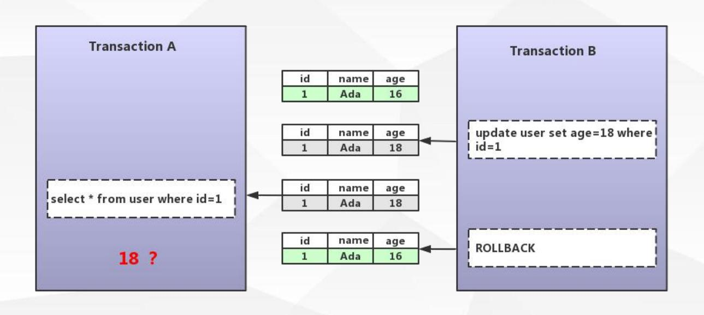
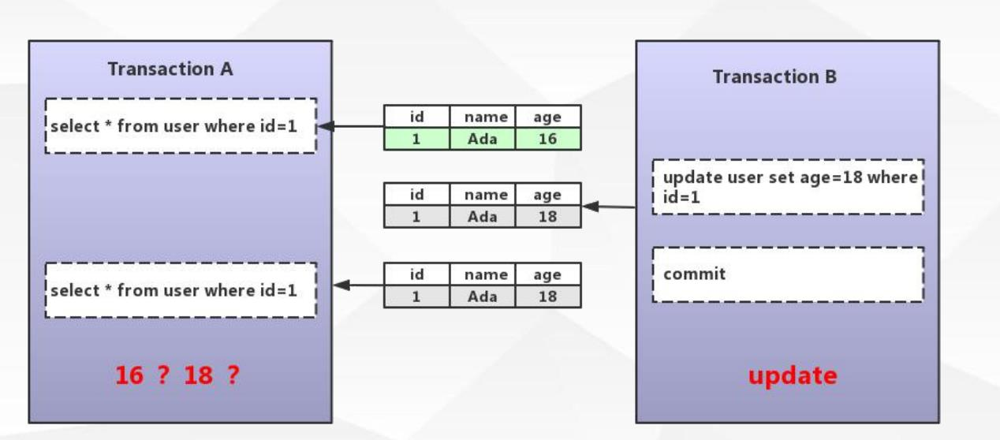
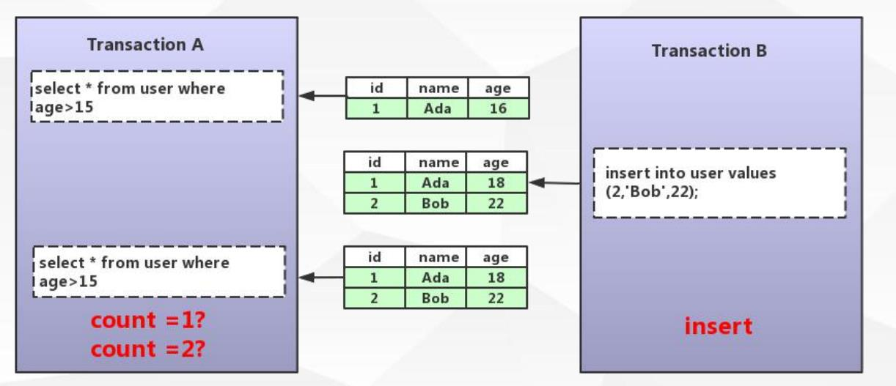

# 事务

> show VARIABLES like 'autocommit';  查看事务状态


### 事务:

数据库操作的最小工作单元，是作为单个逻辑工作单元执行的一系列操作，事务是一组不可再分割的操作集合（工作逻辑单元）;


#### 典型事务场景(转账)：

update user_account set balance = balance - 1000 where userID = 3;
update user_account set balance = balance +1000 where userID = 1;


### 如何开启事务

> begin / start transaction 			-- 手工
> commit / rollback 				-- 事务提交或回滚
> set session autocommit = on/off;	 -- 设定事务是否自动开启  


> SQL : 	set session autocommit = off;   
>
> JDBC:  	connection.setAutoCommit（boolean）;
>
> spring:	connection.commit()

#### autocommit 默认为ON  

update user set name ='zhangsan' where id =1;

> 自动提交


#### 如何开启事务


```sql
BEGIN; 
update user set name ='zhangsan' where id =1;
COMMIT;

BEGIN; 
update user set name ='zhangsan' where id =1;
ROLLBACK;


update user set name ='zhangsan' where id =1;
COMMIT;

START TRANSACTION;
update user set name ='zhangsan' where id =1;
ROLLBACK;

SET SESSION autocommit = OFF;
update user set name ='zhangsan' where id =1;
COMMIT;

SET SESSION autocommit = OFF;
update user set name ='zhangsan' where id =1;
ROLLBACK;

```


###  事务的四大特性

> 原子性（Atomicity）
> 最小的工作单元，整个工作单元要么一起提交成功，要么全部失败回滚
>
> 
> 一致性（Consistency）
> 事务中操作的数据及状态改变是一致的，即写入资料的结果必须完全符合预设的规则，
> 不会因为出现系统意外等原因导致状态的不一致
>
> 
> 隔离性（Isolation）
> 一个事务所操作的数据在提交之前，对其他事务的可见性设定（一般设定为不可见）
>
> 
> 持久性（Durability）
> 事务所做的修改就会永久保存，不会因为系统意外导致数据的丢失
>
> 


### 事务带来的问题


> 脏读   不可重读的  幻读


####  脏读




#### 不可重读的




#### 幻读





# 锁


#  MVCC


